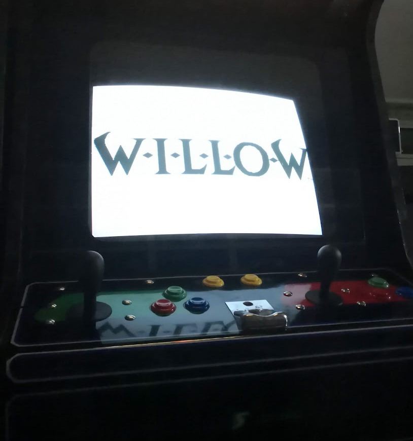

# VideoSonic Industrias Lorenzo Adapters (to be tested)


# ```SPANISH```

¿Qué es esto? 
============
Esto es una PCB, sí, una PCB, no una placa de acero hecha para reemplazar un joystick VideoSonic a uno IL Eurostick 2/Compacto.





## Placa para sustituir Joystick original por IL

Existen 2 arcades universales comunes en España creados por SEGA S.A. (Video Sonic y Super Video) en los años 80 y principios de los 90; estos arcades venían con un stick con interruptores de fabricación suiza.

Hoy en día la mayoría de ellos no son utilizables por el desgaste por lo que hay que buscar la manera de sustituirlos por uno nuevo de una buena marca. Industrias Lorenzo tiene 2 sticks diferentes que tienen aproximadamente las mismas dimensiones que el original pero con un tacto completamente nuevo.

Estos son los joysticks IL Compacto e IL Eurostick 2.

La placa original tiene las dimensiones para el stick personalizado por lo que necesitaremos una placa adaptadora para cambiar los agujeros de los tornillos y poder convertir el antiguo en el nuevo sin modificar el CPO (panel). 


[Industrias Lorenzo Eurostick 2](https://www.industrias-lorenzo.com/es/mandos/96-508-eurojoystick-pe2.html#/55-color_bola-negro/62-color_pomo-blanco)


### ¿Cómo es el mando original?

Así:


## ¿Por qué una placa de circuito impreso y no de acero?
El acero inoxidable es muy difícil de manipular y las placas de circuito impreso son baratas. Los fabricantes locales parecen no saber cómo leer un archivo CAD adecuado o mecanizar con la precisión requerida, aquí hay un intento, arriba está la placa original y abajo el resultado del fabricante local.


Instalación
============
Sólo es necesario colocar los tornillos exteriores del joystick.


Modo de empleo
============
Hay 2 proyectos KiCAD y 2 archivos gerber:

- Industrias Lorenzo Eurostick 2

- Insdustrias Lorenzo Compact

Elegirlos antes de enviar a fabricar, se puede fabricar en FR4 2mm o aluminio.

- [Gerber Industrias Lorenzo Compacto](./GERBERS/adapt_lorenzo_compacto_gerber.zip)

- [Gerber Industrias Lorenzo Eurostick 2](./GERBERS/adapt_lorenzo_eurostick2_gerber.zip)

Son dos placas diferentes ya que las dimensiones entre tornillos son diferentes en ambos joysticks.


# ```ENGLISH```


What's this? 
============
This is a PCB, yes, a PCB, not a steel plate made to replace a VideoSonic joystick to an IL Eurostick/Compact one.


## Plate to replace original Joystick with IL ones

There are 2 universal arcades common in Spain created by SEGA S.A. in the 80's and early 90's; these arcades came with a stick with Swiss made switches.

Nowadays most of them are not usable so we have to find a way to replace them  with a new one of a good brand. Industrias Lorenzo has 2 different sticks that are in about the same dimensions as the original but with a completely new feel.

These are the IL Compact and IL Eurostick 2 joysticks.

The original board has the dimensions for the customized stick so we will need an adapter plate to change the screw holes so that the old one can be converted to the new one without modifying the CPO (panel). 


[Industrias Lorenzo Eurostick 2](https://www.industrias-lorenzo.com/es/mandos/96-508-eurojoystick-pe2.html#/55-color_bola-negro/62-color_pomo-blanco)


### How is the original joystick?

Just like this:


## Why a PCB and not steel?
Stainless steel is very difficult to handle and printed circuit boards are cheap. Local manufacturers seem to not know how to read a proper CAD file or machine with the required accuracy, here is an attempt, above is the original board and below is the manufacturer's result.


Installation
============
You only need to fit the outer screws on the joystick.


How to use
============
There are 2 KiCAD projects and 2 gerber files:

- Industrias Lorenzo Eurostick 2

- Insdustrias Lorenzo Compact

Choose them before sending to manufacture, you can manufacture on FR4 2mm or aluminum.

- [Gerber Industrias Lorenzo Compacto](./GERBERS/adapt_lorenzo_compacto_gerber.zip)

- [Gerber Industrias Lorenzo Eurostick 2](./GERBERS/adapt_lorenzo_eurostick2_gerber.zip)

Two different boards as the dimensions between screws are different on both joysticks.


DISCLAIMER (MIT Licensing)
==========================
Permission to use, copy, modify, and distribute this software for any
purpose with or without fee is hereby granted, provided that the above
copyright notice and this permission notice appear in all copies.

The software is provided "as is" and the author disclaims all warranties
with regard to this software including all implied warranties of
merchantability and fitness. In no event shall the author be liable for
any special, direct, indirect, or consequential damages or any damages
whatsoever resulting from loss of use, data or profits, whether in an
action of contract, negligence or other tortious action, arising out of
or in connection with the use or performance of this software.